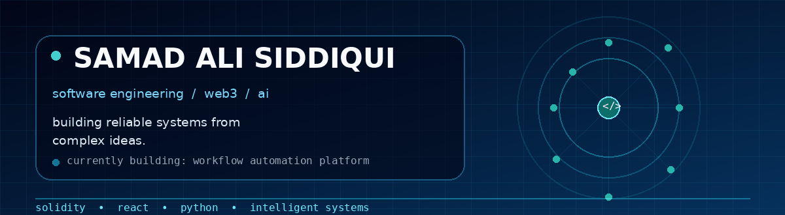

<div align="center">




<br />

<a href="https://github.com/Samad-Ali-S"></a>
<a href="https://www.linkedin.com/in/samad-ali-siddiqui-a6790b323/"></a>

</div>

## Hello, world.

I’m **Samad Ali Siddiqui**, a Software Engineering undergraduate at Muhammad Ali Jinnah University in Karachi. I build at the intersection of **Web3, artificial intelligence, and full-stack engineering**.

I enjoy working on the difficult middle layer between an idea and a dependable product: architecture, data flow, secure logic, user journeys, and interfaces that feel simple even when the system behind them is complex.

```text
focus = ["Web3", "AI", "Full-Stack Systems"]
currently_building = "Visual workflow automation and trading platform"
location = "Karachi, Pakistan"
status = "open to internships, collaborations, and junior engineering roles"
```

## Current build: workflow automation platform

I am currently building a visual workflow-execution platform inspired by node-based automation tools. The project is designed around a graph editor where users can create connected workflows, save them, and eventually execute them through a structured backend.

**What I am learning by building it:**

- Designing a visual node editor with **React Flow**
- Modeling workflows, nodes, and connections for flexible storage
- Structuring a maintainable **monorepo**
- Developing backend logic with **Node.js, MongoDB, and Mongoose**
- Exploring an execution engine for connected workflows and trading-bot logic

[](https://www.youtube.com/watch?v=NYCUMKUBcXM)

> This project is actively evolving. I am documenting the architecture, experiments, and stable milestones as development progresses.

## Selected work

| Project | What it demonstrates |
|---|---|
| **BlockState** | Python, Tauri, React, desktop software, system-level productivity logic, and HCI |
| **React2** | React practice, frontend implementation, and interface experiments |
| **Ubiquitous Spoon** | Ongoing software development and learning through public repositories |

- **BlockState:** Add the public repository URL when ready.
- **React2:** [View repository](https://github.com/Samad-Ali-S/react2)
- **Ubiquitous Spoon:** [View repository](https://github.com/Samad-Ali-S/ubiquitous-spoon)

## Technical direction

<div align="center">


</div>

**Web3:** Solidity · Smart Contracts · Smart-Contract Security · Decentralized Verification · Ethereum  
**Frontend:** React.js · Next.js · JavaScript · HTML · CSS · Tailwind CSS · React Flow  
**Backend and Systems:** Node.js · Python · MongoDB · Mongoose · Tauri · Monorepo Architecture  
**AI:** Machine Learning · AI Agents · LangGraph · LlamaIndex · LLM Integrations · Generative AI  
**Tools:** Git · GitHub · Figma · Software Architecture · Human–Computer Interaction

## Certifications

- Machine Learning Specialization — Coursera / Andrew Ng
- Technology Software Development Job Simulation — Citi through Forage
- React Creating and Hosting a Full-Stack Site — LinkedIn Learning, June 2024
- Blockchain Fundamentals — Chainlink
- Python Essentials 2 — Cisco Networking Academy
- Practical Git and GitHub — LinkedIn Learning

## Education

**Muhammad Ali Jinnah University, Karachi**  
Bachelor of Science in Software Engineering · 2023–2027

## GitHub activity

<div align="center">


<br />


</div>

## Contribution animation

<div align="center">


</div>

## Connect

<div align="center">

[](https://www.linkedin.com/in/samad-ali-siddiqui-a6790b323/)
[](https://github.com/Samad-Ali-S)

</div>

<div align="center">

*Build deliberately. Learn continuously. Ship thoughtfully.*

</div>
